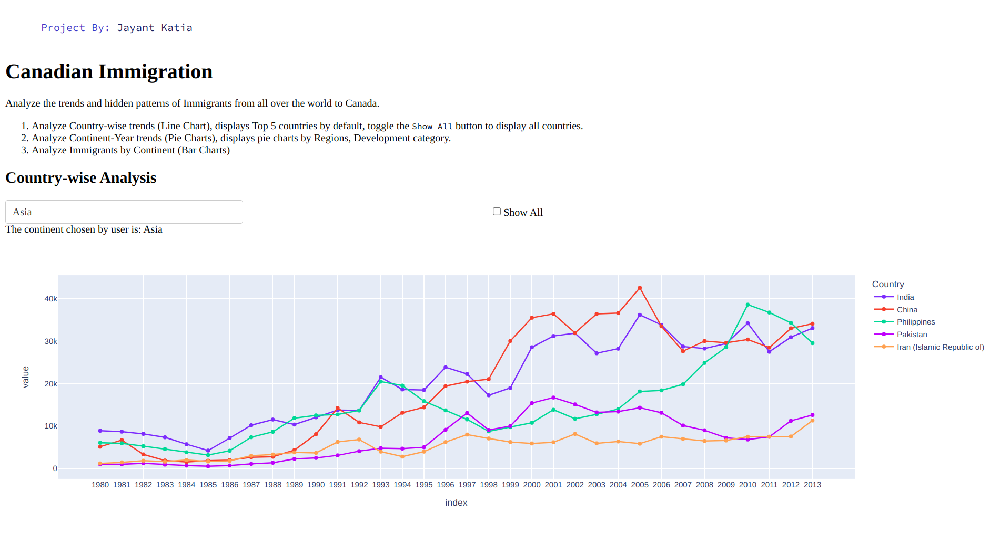
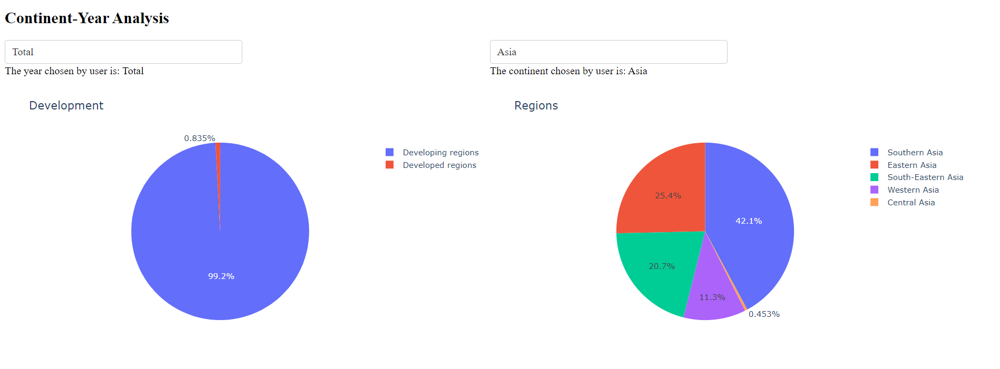
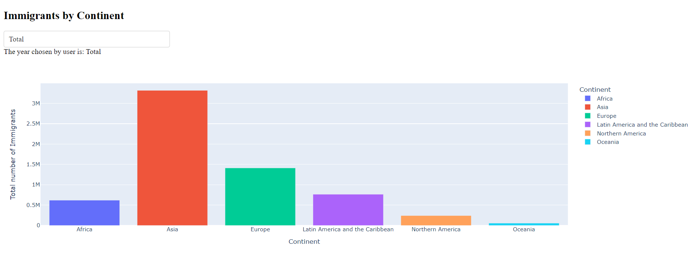

<!-- # Title: ✈️ 🇨🇦 Canadian Immigration Visualization Dashboard
<p align="center"> Dashboard to visualize data of Immigration to Canada by people across the globe. The dashboard story tells the data using line chart, bar graph and pie charts.<p> -->

# Title: Canadian Immigration Visualization Dashboard
## 1. Methodolgy
This dashboard is made using Dash Plotly. The framework uses callbacks to respond to user interactions and render visualizations.


## 2. Description
Dashboard to visualize data of Immigration to Canada by people across the globe. The dashboard story tells the data using line chart, bar graph and pie charts.

## 3. Input / Output
Input: [canadian_immigration_data.csv](https://github.com/jayantkatia/dashboard-visualization/blob/main/canadian_immigration_data.csv)

## 4. Live Link
**Deployed link: https://jayant-dashboard.eastus2.cloudapp.azure.com/**

## 5. Screenshots





<!-- ## 6. 🚀 Get Started with the Installation -->

## 6. Get Started with the Installation
1. Make sure you have python and pip installed
2. Navigate into the project directory
3. Run
    ```shell
       python3 -m venv venv
       source venv/bin/activate
       pip install dash plotly pandas
    ```
    This creates a virtual env and installs all the requirements. 
4. Run
    ```shell
        python dashboard.py
    ```
    This runs the application and you are good to Go 😉

> Use script.sh to deploy and Refer [this guide](https://www.digitalocean.com/community/tutorials/how-to-serve-flask-applications-with-gunicorn-and-nginx-on-ubuntu-22-04)


<!-- 💜 -->
## 7. Development and Contributing
Yes, please! Feel free to contribute, raise issues and recommend best practices.

A few resources:
- [Dash Documentation](https://dash.plotly.com/)
